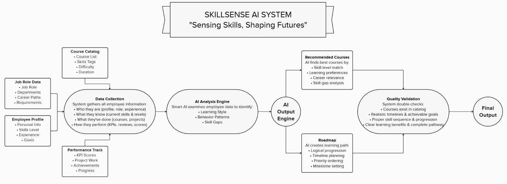

# SkillSense AI - Employee Learning Recommendation System

**Sensing Skills, Shaping Futures**

An intelligent AI-powered platform that transforms employee learning by providing personalized course recommendations and strategic skill development roadmaps. Our system analyzes employee profiles, performance data, and career goals to create tailored learning experiences that drive professional growth and organizational success.



## 🎯 Why SkillSense AI?

### For Organizations

- **Boost Employee Performance**: AI-driven recommendations align learning with actual skill gaps and role requirements
- **Accelerate Career Development**: Structured roadmaps guide employees through logical skill progression
- **Maximize Training ROI**: Targeted recommendations ensure training investments deliver measurable results
- **Reduce Skills Shortage**: Proactive identification and addressing of skill gaps before they impact productivity
- **Data-Driven Insights**: Comprehensive analytics help L&D teams make informed decisions

### For Employees

- **Personalized Learning Journey**: Get recommendations tailored to your specific skills, goals, and learning style
- **Clear Career Progression**: See exactly what skills you need to advance in your career
- **Time-Efficient Learning**: Focus on courses that matter most for your role and aspirations
- **Progress Tracking**: Monitor your learning achievements and skill development over time
- **AI-Powered Guidance**: Receive intelligent suggestions based on your unique profile and performance

## ✨ Key Features

### 🤖 AI-Powered Intelligence

- **Smart Recommendations**: Advanced LLM analysis provides personalized course suggestions with clear reasoning
- **Behavioral Analysis**: Identifies individual learning patterns and preferences for optimal course matching
- **Skill Gap Detection**: Automatically analyzes current skills against role requirements and career goals
- **Quality Assurance**: Multi-agent validation ensures recommendations are relevant and achievable

### 📈 Comprehensive Analytics

- **Performance Dashboards**: Real-time insights into learning progress, KPI tracking, and skill development
- **Career Growth Insights**: Visualize promotion readiness and identify development opportunities
- **Learning Statistics**: Track completion rates, scores, and learning achievements
- **Skill Assessment**: Interactive skill mapping with proficiency levels and progress tracking

### 🗺️ Strategic Learning Paths

- **AI-Generated Roadmaps**: Timeline-based learning sequences that build skills progressively
- **Course Sequencing**: Logical progression from foundational to advanced topics
- **Realistic Timelines**: Achievable learning schedules that consider workload and complexity
- **Adaptive Planning**: Roadmaps adjust based on completion progress and changing requirements

### 👤 Employee-Centric Design

- **Complete Profiles**: Comprehensive view of skills, projects, learning history, and career goals
- **Course Catalog**: Browse and discover courses with intelligent filtering and search
- **Progress Tracking**: Monitor learning journey with detailed completion history and scores
- **Mobile-Friendly**: Responsive design works seamlessly across all devices

## 🏗️ Technical Architecture

### Frontend Technology Stack

- **React 19 + Vite**: Modern frontend framework with lightning-fast development experience
- **Context API**: Centralized state management for authentication and global data
- **Responsive Design**: Mobile-first approach ensuring consistent experience across devices
- **Component Architecture**: Modular, reusable components for maintainable code

### Backend Technology Stack

- **FastAPI**: High-performance Python web framework for scalable API development
- **MySQL Database**: Robust relational database for data persistence and integrity
- **LangGraph**: Advanced multi-agent system for AI recommendation pipeline
- **OpenAI Integration**: Cutting-edge language models for intelligent analysis

### 📊 Database Structure

The system uses a comprehensive MySQL database with the following key tables:

- **`m_roles`**: Master data for organizational roles and skill requirements
- **`m_emp`**: Employee profiles with skills, preferences, and career goals
- **`m_courses`**: Course catalog with metadata and skill mappings
- **`t_emp_kpi`**: Employee performance tracking and KPI metrics
- **`t_course_completion`**: Learning history and completion records
- **`t_emp_projects`**: Project experience and skill utilization
- **`t_recommendation`**: AI-generated recommendations and analysis

The [database.sql](server/database.sql) file includes complete schema definitions and sample data for testing.

### AI Recommendation Engine

The system employs a sophisticated multi-agent architecture:

1. **Data Collection Agent**: Gathers comprehensive employee profiles, course catalogs, and performance data
2. **Analysis Agent**: Performs deep behavioral analysis and identifies skill gaps using advanced algorithms
3. **Recommendation Agent**: Generates personalized course suggestions and learning roadmaps
4. **Validation Agent**: Ensures recommendation quality, relevance, and achievability
5. **Output Agent**: Formats and delivers final recommendations with clear explanations

## 📁 Project Structure

```
skillsense-ai/
├── client/                     # React Frontend Application
│   ├── src/
│   │   ├── components/        # Reusable UI Components
│   │   ├── pages/             # Main Application Pages
│   │   │   ├── Dashboard.jsx
│   │   │   ├── Analytics.jsx
│   │   │   ├── Courses.jsx
│   │   │   └── Profile.jsx
│   │   ├── api/               # API Integration Layer
│   │   ├── context/           # React Context Providers
│   │   └── styles/            # CSS Stylesheets
│   └── package.json
├── server/                     # Python Backend Application
│   ├── api.py                 # FastAPI Route Definitions
│   ├── recommendation_engine.py # AI Recommendation Logic
│   ├── chatbot.py            # AI Assistant Functionality
│   ├── models.py             # Database Models
│   ├── db.py                 # Database Connection
│   ├── database.sql          # Database Schema & Sample Data
│   └── requirements.txt
└── data_workflow.png          # System Architecture Diagram
```

<!-- ## Getting Started -->

### Prerequisites

- **Node.js** (v18 or higher)
- **Python** (v3.8 or higher)
- **MySQL** (v8.0 or higher)
- **OpenAI API Key**

<!-- ### Quick Setup

1. **Clone the Repository**

   ```bash
   git clone https://github.com/your-org/skillsense-ai.git
   cd skillsense-ai
   ```

2. **Frontend Setup**

   ```bash
   cd client
   npm install
   npm run dev
   ```

3. **Backend Setup**

   ```bash
   cd server
   pip install -r requirements.txt
   # Configure .env file with database and API credentials
   python main.py
   ```

4. **Database Setup**
   - Create MySQL database
   - Configure connection in `server/.env`
   - Run database migrations -->

<!-- ## 🎯 How to Use SkillSense AI

### For Employees

1. **Login & Profile Setup**

   - Access the system with your employee ID
   - Complete your profile with skills, interests, and career goals

2. **Explore Your Dashboard**

   - View AI-generated learning roadmaps
   - See personalized course recommendations
   - Track your learning progress and achievements

3. **Browse Courses**

   - Explore the complete course catalog
   - Use intelligent filters to find relevant courses
   - View AI explanations for why courses are recommended

4. **Monitor Your Growth**
   - Access detailed analytics on your learning journey
   - Track KPI improvements and skill development
   - Plan your career progression with data insights

### For Administrators

1. **Employee Analytics**

   - Monitor organizational learning trends
   - Identify skill gaps across teams
   - Track training effectiveness and ROI

2. **Course Management**
   - Manage course catalog and metadata
   - Monitor course popularity and completion rates
   - Analyze recommendation patterns -->

## API Reference

### Core Endpoints

| Endpoint                  | Method | Description                           |
| ------------------------- | ------ | ------------------------------------- |
| `/recommend`              | POST   | Generate personalized recommendations |
| `/refresh_recommendation` | POST   | Refresh existing recommendations      |
| `/employee/{emp_id}`      | GET    | Retrieve employee profile             |
| `/courses`                | GET    | Get course catalog                    |
| `/completion/{emp_id}`    | GET    | Get learning history                  |
| `/kpi/{emp_id}`           | GET    | Get performance metrics               |

### Authentication

All endpoints require valid employee authentication via the login system.

<!-- ## Security & Privacy

- **Data Protection**: All employee data is encrypted and securely stored
- **Access Control**: Role-based permissions ensure data privacy
- **API Security**: Secure authentication and authorization mechanisms
- **Compliance**: Adheres to data protection regulations and best practices -->

## 🔧 Performance & Scalability

### Optimization Features

- **Fast Loading**: Vite-powered frontend with optimized build process
- **Efficient APIs**: FastAPI backend with async processing
- **Smart Caching**: Strategic caching for improved response times
- **Database Optimization**: Indexed queries and optimized data retrieval

### Scalability

- **Microservices Ready**: Modular architecture supports horizontal scaling
- **Cloud Compatible**: Deploy on AWS, Azure, or Google Cloud
- **Load Balancing**: Support for high-availability configurations

## 🔍 Troubleshooting

### Common Issues

**Database Connection Problems**

- Verify MySQL service is running
- Check credentials in `server/.env`
- Ensure database exists and is accessible

**API Key Issues**

- Confirm OpenAI API key is valid and active
- Check API usage limits and quotas
- Verify key permissions for required operations

**Frontend Build Errors**

- Clear `node_modules` and reinstall dependencies
- Check Node.js version compatibility
- Update packages to latest compatible versions

---

**SkillSense AI** - Transforming employee learning through intelligent recommendations and personalized skill development paths.
