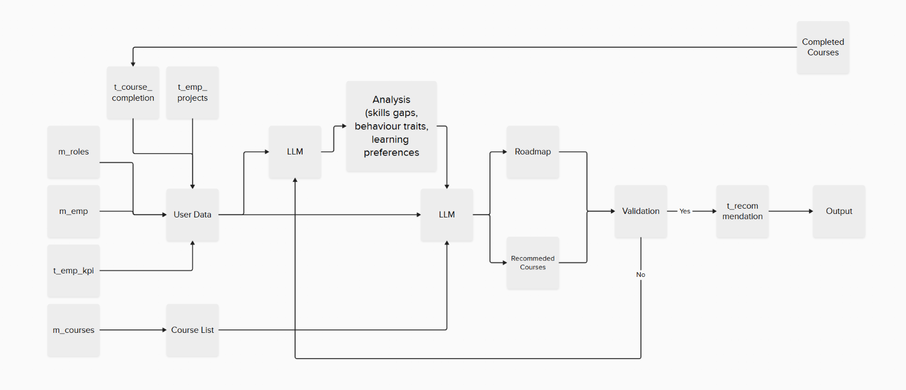
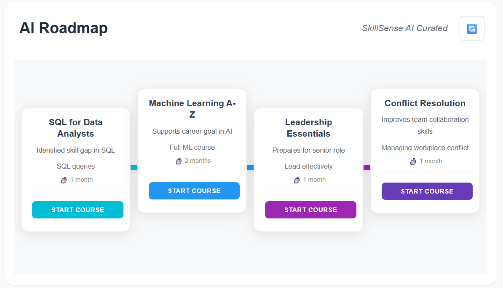
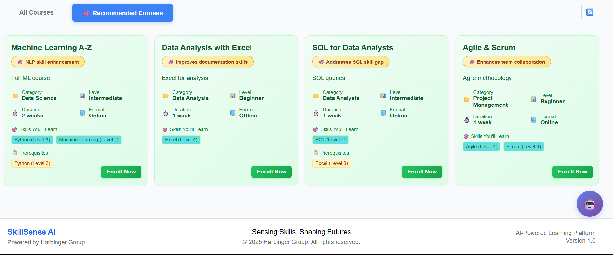

# SkillSense AI - Employee Learning Recommendation System

**Sensing Skills, Shaping Futures**

An intelligent AI-powered platform that transforms employee learning by providing personalized course recommendations and strategic skill development roadmaps. Our system analyzes employee profiles, performance data, and career goals to create tailored learning experiences that drive professional growth and organizational success.


## 🎯 Why SkillSense AI?

### For Organizations

- **Boost Employee Performance**: AI-driven recommendations align learning with actual skill gaps and role requirements
- **Accelerate Career Development**: Structured roadmaps guide employees through logical skill progression
- **Maximize Training ROI**: Targeted recommendations ensure training investments deliver measurable results
- **Reduce Skills Shortage**: Proactive identification and addressing of skill gaps before they impact productivity
- **Project Team Optimization**: Advanced team skill assessment for optimal project assignments

### For Employees

- **Personalized Learning Journey**: Get recommendations tailored to your specific skills, goals, and learning style
- **Clear Career Progression**: See exactly what skills you need to advance in your career
- **Time-Efficient Learning**: Focus on courses that matter most for your role and aspirations
- **Progress Tracking**: Monitor your learning achievements and skill development over time
- **AI-Powered Guidance**: Receive intelligent suggestions based on your unique profile and performance

## ✨ Key Features

### AI-Powered Intelligence

- **Smart Recommendations**: Advanced LLM analysis provides personalized course suggestions with clear reasoning
- **Behavioral Analysis**: Identifies individual learning patterns and preferences for optimal course matching
- **Skill Gap Detection**: Automatically analyzes current skills against role requirements and career goals
- **Quality Assurance**: Multi-agent validation ensures recommendations are relevant and achievable

### Project Management & Team Analysis

- **Project Readiness Assessment**: Comprehensive skill coverage analysis for project teams
- **Team Skill Matrix**: Visual representation of individual and collective team capabilities
- **Manager Dashboard**: Project managers can view and analyze all assigned projects
- **Skill Gap Identification**: Highlights missing or insufficient skills within project teams

### Comprehensive Analytics

- **Performance Dashboards**: Real-time insights into learning progress, KPI tracking, and skill development
- **Career Growth Insights**: Visualize promotion readiness and identify development opportunities
- **Learning Statistics**: Track completion rates, scores, and learning achievements
- **Skill Assessment**: Interactive skill mapping with proficiency levels and progress tracking

### Strategic Learning Paths

- **AI-Generated Roadmaps**: Timeline-based learning sequences that build skills progressively
- **Course Sequencing**: Logical progression from foundational to advanced topics
- **Realistic Timelines**: Achievable learning schedules that consider workload and complexity
- **Adaptive Planning**: Roadmaps adjust based on completion progress and changing requirements

### Employee-Centric Design

- **Complete Profiles**: Comprehensive view of skills, projects, learning history, and career goals
- **Course Catalog**: Browse and discover courses with intelligent filtering and search
- **Progress Tracking**: Monitor learning journey with detailed completion history and scores
- **Mobile-Friendly**: Responsive design works seamlessly across all devices

## Technical Architecture

### Frontend Technology Stack

- **React 19 + Vite**: Modern frontend framework with lightning-fast development experience
- **Context API**: Centralized state management for authentication and global data
- **Responsive Design**: Mobile-first approach ensuring consistent experience across devices
- **Component Architecture**: Modular, reusable components for maintainable code

### Backend Technology Stack

- **FastAPI**: High-performance Python web framework for scalable API development
- **MySQL Database**: Robust relational database for data persistence and integrity
- **LangGraph**: Advanced multi-agent system for AI recommendation pipeline
- **OpenAI Integration**: Cutting-edge language models for intelligent analysis
- **SQLAlchemy**: Modern ORM for database operations and model management

### AI Recommendation Engine

The system employs a sophisticated multi-agent architecture:

1. **Data Collection Agent**: Gathers comprehensive employee profiles, course catalogs, and performance data
2. **Analysis Agent**: Performs deep behavioral analysis and identifies skill gaps using advanced algorithms
3. **Recommendation Agent**: Generates personalized course suggestions and learning roadmaps
4. **Validation Agent**: Ensures recommendation quality, relevance, and achievability
5. **Output Agent**: Formats and delivers final recommendations with clear explanations



The above diagram illustrates the complete technical architecture and data flow of SkillSense AI, showing how user interactions trigger the AI recommendation pipeline and database operations.

### Project Structure

```
SkillSense AI/
├── client/                    # React frontend application
│   ├── src/
│   │   ├── components/       # Reusable UI components
│   │   │   ├── Dashboard/    # Dashboard components and timeline
│   │   │   ├── Courses/      # Course-related components
│   │   │   ├── Layout/       # Layout components (Header, Footer, ChatBot)
│   │   │   ├── YourTeam/     # Project readiness and team management
│   │   │   └── Shared/       # Shared utility components
│   │   ├── context/          # Context providers for state management
│   │   ├── api/              # API integration functions
│   │   └── ...
├── server/                   # FastAPI backend application
│   ├── api.py               # Main FastAPI application and routes
│   ├── models.py            # SQLAlchemy database models
│   ├── db.py                # Database connection configuration
│   ├── recommendation_engine.py  # AI recommendation pipeline
│   ├── chatbot.py           # AI chatbot functionality
│   ├── config.py            # Configuration management
│   ├── .env                 # Environment variables
│   └── ...
├── database/                # Database scripts and dummy_data
├── data_workflow.png        # Data workflow diagram
├── technical_workflow.png   # Technical architecture diagram
├── recommended_courses_ui_example.png # UI screenshot
├── roadmap_ui_example.png   # Roadmap UI screenshot
└── README.md
```

### Database Structure

The system uses a comprehensive MySQL database with the following key tables:

- **`m_roles`**: Master data for organizational roles and skill requirements
- **`m_emp`**: Employee profiles with skills, preferences, and career goals
- **`m_courses`**: Course catalog with metadata and skill mappings
- **`m_projects`**: Project definitions with required skills and client information
- **`t_emp_kpi`**: Employee performance tracking and KPI metrics
- **`t_course_completion`**: Learning history and completion records
- **`t_ongoing_courses`**: Currently enrolled courses and progress tracking
- **`t_emp_projects`**: Employee-project assignments and roles
- **`t_recommendation`**: AI-generated recommendations and analysis

Database files are located in the [database/](database/) directory with creation scripts and sample data.

### Database Schema

#### Master Tables

**`m_roles`** - Organizational Roles and Requirements

```sql
CREATE TABLE m_roles (
    role_id INT PRIMARY KEY,
    role VARCHAR(100),
    dept VARCHAR(100),
    job_level VARCHAR(50),
    skills_required JSON,
    avg_promotion_time INT
);
```

**`m_emp`** - Employee Master Data

```sql
CREATE TABLE m_emp (
    emp_id INT PRIMARY KEY,
    name VARCHAR(100),
    role_id INT,
    role VARCHAR(100),
    dept VARCHAR(100),
    skills JSON,
    learning_preferences VARCHAR(100),
    interests VARCHAR(100),
    career_goal VARCHAR(100),
    join_date DATE,
    last_promotion_date DATE,
    experience INT,
    languages VARCHAR(100),
    manager_ids JSON,
    FOREIGN KEY (role_id) REFERENCES m_roles(role_id)
);
```

**`m_courses`** - Course Catalog

```sql
CREATE TABLE m_courses (
    course_id INT PRIMARY KEY,
    name VARCHAR(100),
    category VARCHAR(100),
    `desc` TEXT,
    skills JSON,
    format VARCHAR(50),
    level VARCHAR(50),
    prerequisite_skills JSON,
    duration FLOAT
);
```

**`m_projects`** - Project Master Data

```sql
CREATE TABLE m_projects (
    project_id INT PRIMARY KEY,
    project_name VARCHAR(100),
    client VARCHAR(100),
    duration FLOAT,
    start_date DATE,
    skills JSON,
    status VARCHAR(50),
    manager_ids JSON
);
```

#### Transaction Tables

**`t_emp_kpi`** - Employee Performance Metrics

```sql
CREATE TABLE t_emp_kpi (
    kpi_id INT PRIMARY KEY AUTO_INCREMENT,
    emp_id INT,
    month DATE,
    kpi_metric VARCHAR(100),
    kpi_score DECIMAL(5,2),
    review TEXT,
    FOREIGN KEY (emp_id) REFERENCES m_emp(emp_id)
);
```

**`t_course_completion`** - Learning History

```sql
CREATE TABLE t_course_completion (
    emp_id INT,
    course_id INT,
    start_date DATE,
    end_date DATE GENERATED ALWAYS AS (DATE_ADD(start_date, INTERVAL expected_duration MONTH)) STORED,
    duration FLOAT,
    expected_duration FLOAT,
    score DECIMAL(5,2),
    FOREIGN KEY (emp_id) REFERENCES m_emp(emp_id),
    FOREIGN KEY (course_id) REFERENCES m_courses(course_id)
);
```

**`t_ongoing_courses`** - Current Enrollments

```sql
CREATE TABLE t_ongoing_courses (
    emp_id INT,
    course_id INT,
    course_name VARCHAR(100),
    start_date DATE,
    current_progress INT CHECK (current_progress >= 0 AND current_progress < 100),
    FOREIGN KEY (emp_id) REFERENCES m_emp(emp_id),
    FOREIGN KEY (course_id) REFERENCES m_courses(course_id)
);
```

**`t_emp_projects`** - Project Assignments

```sql
CREATE TABLE t_emp_projects (
    tep_id INT PRIMARY KEY AUTO_INCREMENT,
    emp_id INT,
    project_id INT,
    role VARCHAR(100),
    skills JSON,
    FOREIGN KEY (emp_id) REFERENCES m_emp(emp_id),
    FOREIGN KEY (project_id) REFERENCES m_projects(project_id)
);
```

**`t_recommendation`** - AI Recommendations

```sql
CREATE TABLE t_recommendation (
    recommendation_id INT PRIMARY KEY AUTO_INCREMENT,
    emp_id INT,
    goal VARCHAR(255),
    output JSON,
    analysis JSON,
    valid BOOLEAN,
    validation_summary JSON,
    last_updated_time DATETIME,
    FOREIGN KEY (emp_id) REFERENCES m_emp(emp_id),
    UNIQUE KEY unique_emp_goal (emp_id, goal)
);
```

### Prerequisites

- **Node.js** (v18 or higher)
- **Python** (v3.8 or higher)
- **MySQL** (v8.0 or higher)
- **OpenAI API Key**

### Environment Configuration

**Server `.env` file:**

```env
# Database Configuration
DB_USER=root
DB_PASSWORD=your_mysql_password
DB_HOST=localhost
DB_PORT=3306
DB_NAME=recom_dummy

# API Keys
GPT_API_KEY=your_openai_api_key_here
```

## API Reference

### Endpoints

| Endpoint                             | Method | Description                                   | Parameters                   |
| ------------------------------------ | ------ | --------------------------------------------- | ---------------------------- |
| `/recommend`                         | POST   | Generate personalized recommendations         | `emp_id`, `goal`             |
| `/refresh_recommendation`            | POST   | Refresh existing recommendations              | `emp_id`, `goal`             |
| `/employee/{emp_id}`                 | GET    | Retrieve employee profile                     | `emp_id` (path)              |
| `/courses`                           | GET    | Get complete course catalog                   | None                         |
| `/roles`                             | GET    | Get all organizational roles                  | None                         |
| `/completion/{emp_id}`               | GET    | Get employee learning history                 | `emp_id` (path)              |
| `/kpi/{emp_id}`                      | GET    | Get employee performance metrics              | `emp_id` (path)              |
| `/projects/{emp_id}`                 | GET    | Get employee project experience               | `emp_id` (path)              |
| `/chat`                              | POST   | AI chatbot interaction                        | `emp_id`, `message`          |
| `/ongoing_courses/{emp_id}`          | GET    | Get employee's ongoing courses with progress  | `emp_id` (path)              |
| `/team/{manager_id}`                 | GET    | Get team members for a manager                | `manager_id` (path)          |
| `/team-analytics/{manager_id}`       | GET    | Get team performance analytics                | `manager_id` (path)          |
| `/bulk-employee-data`                | GET    | Get comprehensive data for multiple employees | `emp_ids` (query, comma-sep) |
| `/projects/manager/{emp_id}`         | GET    | Get projects managed by an employee           | `emp_id` (path)              |
| `/projects/{project_id}/assignments` | GET    | Get team members assigned to a project        | `project_id` (path)          |
| `/projects/{project_id}/skills`      | GET    | Get skill requirements                        |

### Authentication

All endpoints require valid employee authentication via the login system.

## Important Functions

### Core Recommendation Engine

| Function                   | File                                                        | Description                                        | Usage                                   |
| -------------------------- | ----------------------------------------------------------- | -------------------------------------------------- | --------------------------------------- |
| `build_graph()`            | [recommendation_engine.py](server/recommendation_engine.py) | Creates LangGraph workflow for AI recommendations  | Multi-agent pipeline orchestration      |
| `run_recommendation()`     | [recommendation.py](server/recommendation.py)               | Main function to generate/retrieve recommendations | Handles caching and database operations |
| `refresh_recommendation()` | [recommendation.py](server/recommendation.py)               | Forces regeneration of recommendations             | Bypasses cache for fresh analysis       |

### Data Collection & Analysis

| Function              | File                                                        | Description                                           | Usage                                       |
| --------------------- | ----------------------------------------------------------- | ----------------------------------------------------- | ------------------------------------------- |
| `collect_user_data()` | [recommendation_engine.py](server/recommendation_engine.py) | Gathers employee profile, KPIs, projects, courses     | First step in recommendation pipeline       |
| `analyze_user_data()` | [recommendation_engine.py](server/recommendation_engine.py) | AI analysis of employee behavior and skill gaps       | Identifies learning patterns and needs      |
| `generate_output()`   | [recommendation_engine.py](server/recommendation_engine.py) | Creates personalized course recommendations           | Uses LLM to match courses to employee needs |
| `validate_output()`   | [recommendation_engine.py](server/recommendation_engine.py) | Quality assurance for AI recommendations              | Ensures output validity and relevance       |
| `serialize()`         | [recommendation_engine.py](server/recommendation_engine.py) | Converts database objects to JSON-serializable format | Data transformation for API responses       |

### Chatbot & AI Processing

| Function                 | File                            | Description                                       | Usage                       |
| ------------------------ | ------------------------------- | ------------------------------------------------- | --------------------------- |
| `process_chat_message()` | [chatbot.py](server/chatbot.py) | Main chatbot processing with streaming response   | Real-time AI conversations  |
| `get_employee_data()`    | [chatbot.py](server/chatbot.py) | Retrieves comprehensive employee context for chat | Personalized chat responses |
| `build_system_prompt()`  | [chatbot.py](server/chatbot.py) | Creates context-aware prompts for LLM             | Dynamic prompt generation   |
| `chat_node()`            | [chatbot.py](server/chatbot.py) | LangGraph node for streaming chat responses       | Graph-based chat processing |

### Utility Functions

| Function               | File                                      | Description                           | Usage                               |
| ---------------------- | ----------------------------------------- | ------------------------------------- | ----------------------------------- |
| `extract_json_block()` | [extract_json.py](server/extract_json.py) | Extracts JSON from LLM text responses | Parses AI-generated structured data |

## 🔍 Troubleshooting

### Common Issues

**Database Connection Problems**

- Verify MySQL service is running
- Check credentials in `server/.env`
- Ensure database exists and is accessible

**API Key Issues**

- Confirm OpenAI API key is valid and active
- Check API usage limits and quotas
- Verify key permissions for required operations

**Frontend Build Errors**

- Clear `node_modules` and reinstall dependencies
- Check Node.js version compatibility
- Update packages to latest compatible versions

---

## Sample Case

### Employee Profile: ID 101 (Arjun Verma)

#### 1. Employee Data Collection

**Employee Master Data (`m_emp`)**
| emp_id | name | role_id | role | dept | skills | learning_preferences | interests | career_goal | join_date | last_promotion_date | experience | languages | manager_ids |
|--------|-------------|---------|-------------------|-------------|-----------------------------------------------------------------------|---------------------|--------------------------|-------------|-------------|---------------------|------------------------|----------------|-------------|
| 101 | Arjun Verma | 1 | Software Engineer | Engineering | {"Git": 4, "Django": 2, "Python": 3, "REST APIs": 3, "PostgreSQL": 3} | Online | AI, Web Dev, Blockchain | Senior Dev | 2021-07-10 | 2023-07-10 | 48 | English, Hindi | [113, 119] |

**Role Requirements (`m_roles`)**
| role_id | role | dept | job_level | skills_required | avg_promotion_time |
|---------|------|------|-----------|-----------------|---------------------------|
| 1 | Software Engineer | Engineering | Junior | {"Git": 3, "Python": 3} | 24 |
| 2 | Senior Software Engineer | Engineering | Mid | {"Git": 4, "Python": 4, "System Design": 3, "Leadership": 2} | 36 |

#### 2. Performance Analytics

**KPI Metrics (`t_emp_kpi`)**
| kpi_id | emp_id | month | kpi_metric | kpi_score | review |
|--------|--------|-------|------------|-----------|---------|
| 1 | 101 | 2024-01-01 | Feedback | 4.5 | Peers praised timely delivery |
| 2 | 101 | 2024-02-01 | Code Quality | 4.2 | Clean modular code |
| 3 | 101 | 2024-03-01 | Bug Resolution | 4.6 | Fixed critical issues fast |
| 4 | 101 | 2024-04-01 | Team Collaboration | 4.0 | Great sync with frontend |
| 5 | 101 | 2024-05-01 | Documentation | 3.9 | Needs slight improvement |

#### 3. Learning History

**Course Completion (`t_course_completion`)**
| emp_id | course_id | start_date | end_date | duration | expected_duration | score |
|--------|-----------|------------|------------|----------|-------------------|-------|
| 101 | 201 | 2024-01-01 | 2024-03-01 | 2.3 | 2.5 | 4.60 |
| 101 | 222 | 2024-09-01 | 2025-01-01 | 3.7 | 4 | 4.30 |

**Ongoing Courses (`t_ongoing_courses`)**
| emp_id | course_id | course_name | start_date | current_progress |
|--------|-----------|-------------|------------|------------------|
| 101 | 202 | Advanced Java | 2025-06-01 | 75 |

#### 4. Project Experience

**Projects Master (`m_projects`)**
| project_id | project_name | client | duration | start_date | skills | status | manager_ids |
|------------|----------------------------|--------------------|----------|-------------|-------------------------------------------------------------|-------------|---------------|
| 1001 | Inventory Automation Tool | TechCorp Inc | 6 | 2023-07-15 | {"SQL": 3, "Flask": 3, "Python": 4} | Completed | [113, 105] |
| 1011 | AI Chatbot Integration | E-Commerce Ltd | 4 | 2025-06-20 | {"NLP": 3, "Rasa": 3, "Python": 4} | In Progress | [113, 120] |
| 1021 | Cloud Native Migration | CloudFirst Ltd | 10 | 2025-08-15 | {"Java": 4, "Cloud": 4, "Kubernetes": 4} | Planned | [113, 127] |

**Employee Projects (`t_emp_projects`)**
| tep_id | emp_id | project_id | role | skills |
|--------|--------|------------|------------------|----------------------------------------------|
| 1 | 101 | 1001 | Backend Developer| {"SQL": 3, "Flask": 2, "Python": 3} |
| 2 | 101 | 1011 | Backend Developer| {"APIs": 3, "Python": 3, "Integration": 2} |
| 3 | 101 | 1021 | Senior Developer | {"Cloud": 2, "Python": 3, "Microservices": 2}|

#### 5. Available Courses

**Course Catalog (`m_courses`)**
| course_id | name | category | desc | skills | format | level | prerequisite_skills | duration |
|-----------|------|----------|------|--------|--------|-------|-------------------|----------|
| 201 | Intro to Python | Programming | Learn Python basics for beginners | {"Python": 3} | Online | Beginner | null | 1.0 |
| 202 | Advanced Java | Programming | Deep dive into Java enterprise development | {"Java": 4, "Spring": 3} | Online | Advanced | {"Java": 3} | 2.0 |
| 203 | Machine Learning A-Z | Data Science | Complete machine learning course from basics to advanced | {"Machine Learning": 4, "Python": 3, "Statistics": 3} | Online | Intermediate | {"Python": 2} | 3.0 |
| 204 | System Design Fundamentals | Architecture | Learn scalable system design principles | {"System Design": 3, "Architecture": 3} | Online | Intermediate | {"Programming": 3} | 2.5 |
| 205 | SQL for Data Analysts | Database | Master SQL for data analysis and reporting | {"SQL": 4, "Data Analysis": 3} | Online | Intermediate | null | 1.5 |
| 206 | Leadership Skills | Management | Develop leadership and team management skills | {"Leadership": 3, "Communication": 3} | Hybrid | Beginner | null | 1.0 |
| 207 | Technical Documentation | Communication | Improve technical writing and documentation skills | {"Documentation": 3, "Communication": 3} | Online | Beginner | null | 0.5 |

#### 6 AI recommendation and analysis

**AI Analysis**

```
{"skill_gaps": ["SQL", "Testing", "Cloud", "Microservices"], "behavior_traits": ["proactive", "collaborative", "adaptable"], "learning_preferences": ["Online"]}
```

**Recommendations (`t_recommendation`)**
| recommendation_id | emp_id | goal | output | analysis | valid | validation_summary | last_updated_time |
|-------------------|--------|------|---------|----------|--------|-------------------|-------------------|
| 34 | 101 | courses | [{"name": "SQL for Data Analysts", "reason": "Strengthens SQL skills", "course_id": 205}, {"name": "Microservices Architecture", "reason": "Enhances microservices expertise", "course_id": 211}, {"name": "AWS Certified DevOps", "reason": "Develops cloud s... | {"skill_gaps": ["SQL", "Testing", "Cloud", "Microservices"], "behavior_traits": ["proactive", "collaborative", "adaptable"], "learning_preferences": ["Online"]} | 0 | {"valid": false, "reason": "SQL for Data Analysts is a new recommendation and does not exist in completed or ongoing courses, but it is still valid since it addresses a skill gap. However, the ongoing course Advanced Java is critical and already included... | 2025-08-06 17:23:16 |
| 10 | 101 | roadmap | {"roadmap": [{"desc": "SQL queries", "order": 1, "c_name": "SQL for Data Analysts", "reason": "Essential for data querying skills", "duration": 2.0, "course_id": "205"}, {"desc": "Automated testing", "order": 2, "c_name": "Test Automation with Selenium",... | {"skill_gaps": ["SQL", "Testing", "Flask", "Cloud", "Microservices"], "behavior_traits": ["Adaptable", "Collaborative", "Detail-oriented", "Proactive", "Goal-driven"], "learning_preferences": ["Online"]} | 0 | {"valid": false, "reason": "Recommended course 'SQL for Data Analysts' is a critical issue; already completed course 'SQL for Data Analysts'"} | 2025-08-06 17:22:30 |

## Sample User Interface Output




